# Finance LLM 사용자 신고 기반 개선 루프

## 현재 구현 운영 가이드

원문 작성일: 2026년 7월 26일<br>
재개정일: 2026년 9월 12일<br>
대상: 제품 운영자 · 개발자 · 품질 검증 담당자<br>
문서 목적: 사용자 신고 접수, 재현 자산 고정, 릴리스별 실행, 비교 판단, 이슈 종결을 현재 코드 기준으로 설명한다.

> **핵심 결론:** 현재 구현에는 `신고 → Supabase 이슈 → Fixture·FixedSnapshot·Case → Baseline·Candidate Run → Comparison → 이슈 분류`의 루프가 있다. 다만 Comparison 뒤 종결은 권장 순서이지 서버가 강제하는 선행 조건이 아니며, 이 문서는 hosted 배포 완료를 증명하지 않는다.

### 전체 동작 화면

2026년 9월 12일 현재 코드와 문서용 합성 fixture로 신고 접수부터 종결 준비까지 다시 캡처했다. 실제 사용자 신고나 운영 backend를 사용하지 않았고, 외부 시스템에 기록을 남기는 동작도 실행하지 않았다. 화면의 사람·회사·버전·답변·식별자는 모두 문서용 예시다.

1. **Chat에서 신고 진입** — 문제가 발생한 응답에서 `신고`를 열고 신고 대상을 고른다.

   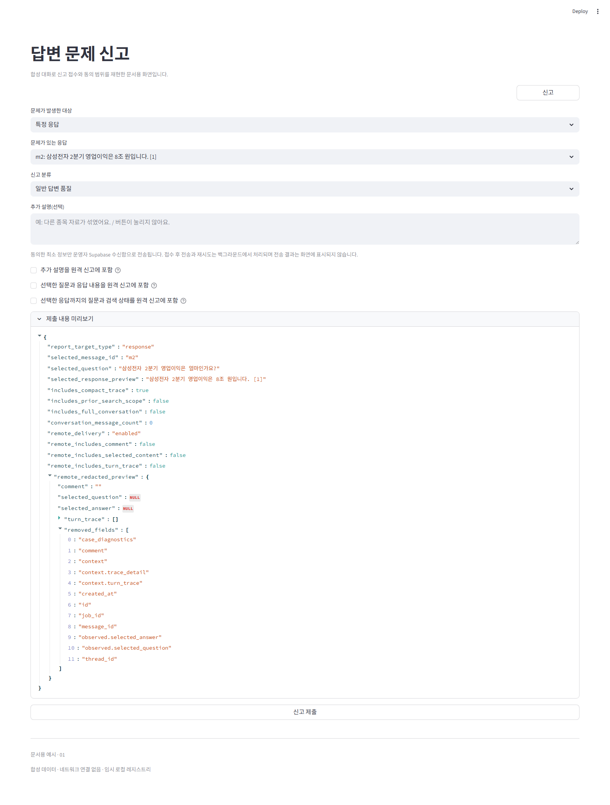

2. **신고 분류·동의·미리보기** — 기본 해제된 원격 전송 항목을 고르고 redaction 결과를 제출 전에 확인한다. 이 예시는 촬영용 preview일 뿐 실제로 제출하지 않았다.

   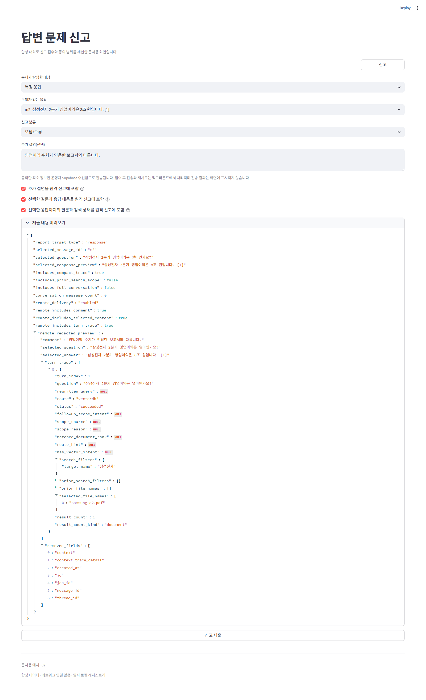

3. **작업함 선별** — 상태 필터와 목록에서 Issue를 선택하고 요약·동의된 원문·진행 상태를 확인한다. 화면의 원문은 합성 client가 반환한 예시이며 실제 원격 조회나 audit을 실행하지 않았다.

   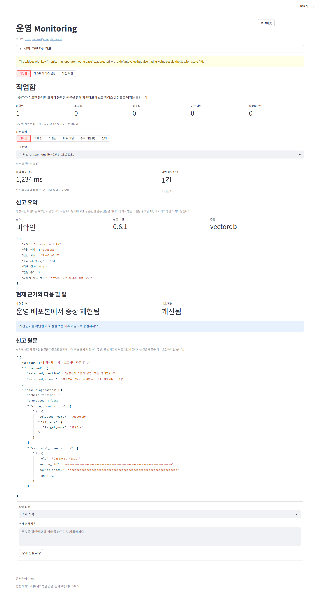

4. **신고 분류와 조치 시작** — 신고 버전·route·관측값과 현재 재현·비교 상태를 함께 본다.

   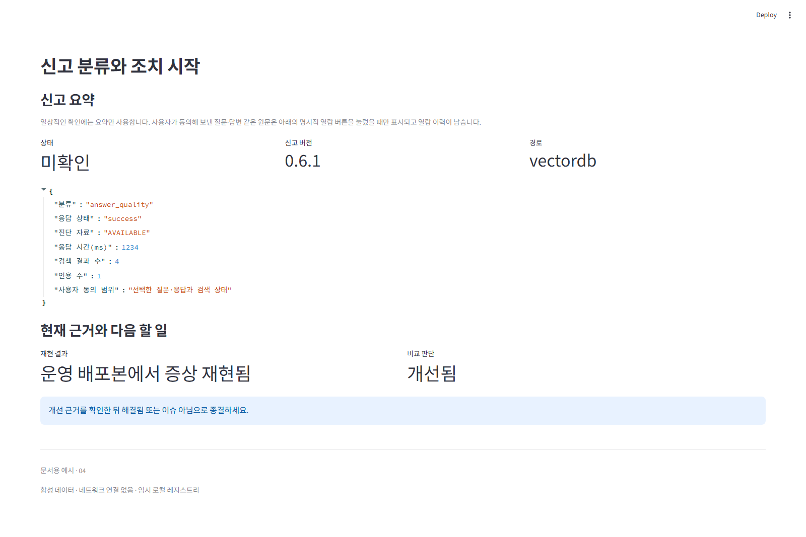

5. **다음 행동 확인** — Baseline에서 증상이 재현된 뒤 Candidate를 실행해야 한다는 안내를 확인한다.

   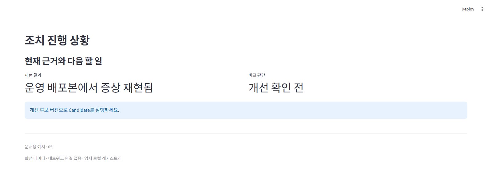

6. **Fixture READY 확인** — 질문·문제 증상·기대 동작·typed check와 수동 확인 항목이 고정됐는지 확인한다.

   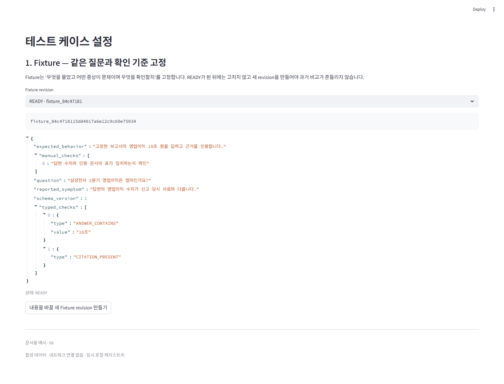

7. **FixedSnapshot·Lineage 확인** — 신고 당시 문서와 현재 고정 자료가 `EXACT`로 대응되고 Case가 READY인지 확인한다.

   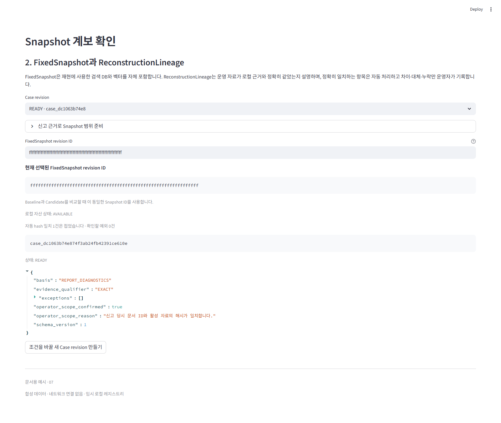

8. **Baseline 결과 확인** — 신고 버전 `v0.6.1`의 `SUCCEEDED + VALID` Run이 `10조` 검사를 통과하지 못해 증상을 재현한 예시다.

   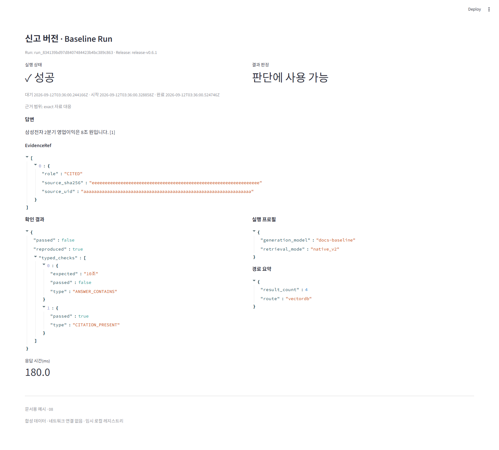

9. **Candidate 결과 확인** — 개선 후보 `v0.6.2`의 `SUCCEEDED + VALID` Run이 같은 검사와 인용 조건을 통과한 예시다.

   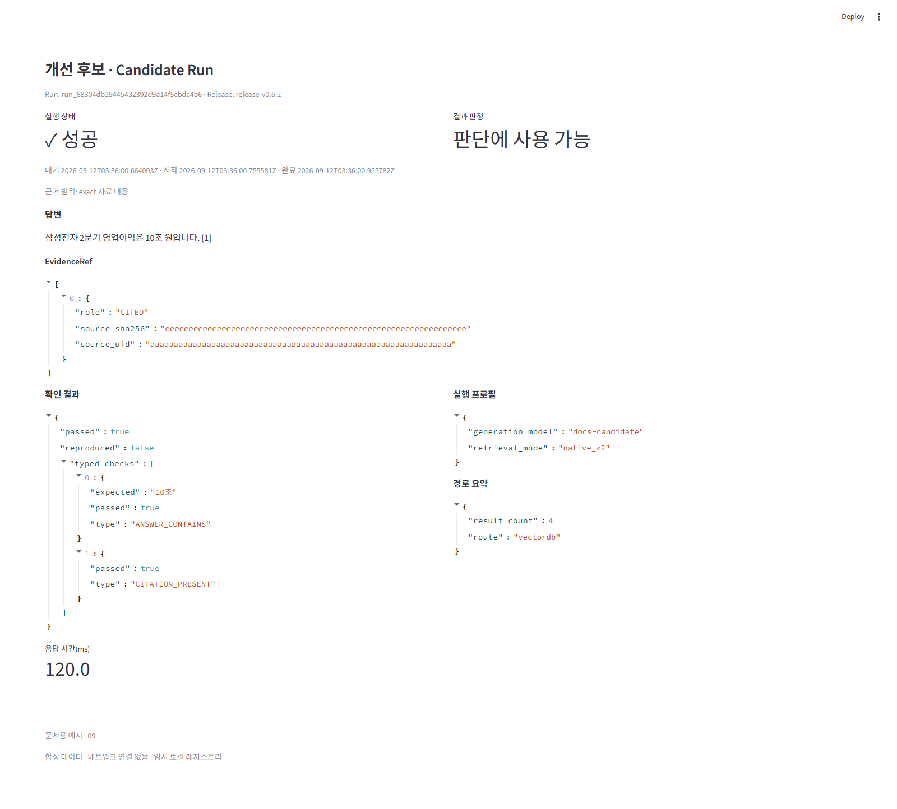

10. **개선 확인 전체 화면** — 같은 Case의 Baseline `v0.6.1`과 Candidate `v0.6.2` 실행 결과를 두 열에서 검토하고 판단에 사용할 Run을 고른다. 저장된 판단 이력은 접힌 영역에서 별도로 연다.

    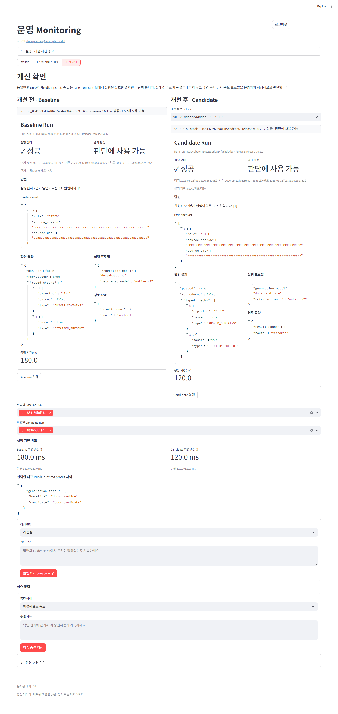

11. **답변·근거 비교** — Baseline의 `8조`와 Candidate의 `10조`, 양쪽 EvidenceRef를 나란히 본다.

    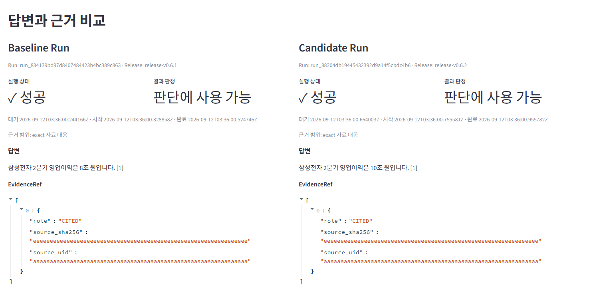

12. **typed check 비교** — 왼쪽 Baseline과 오른쪽 Candidate에서 같은 `ANSWER_CONTAINS: 10조`와 `CITATION_PRESENT` 결과가 어떻게 달라지는지 본다.

    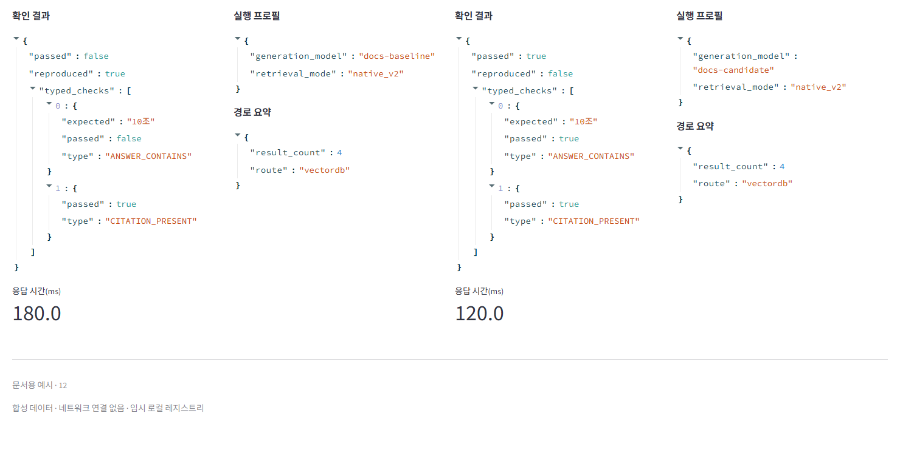

13. **Comparison 판단 입력** — 정성 verdict와 판단 근거를 입력한다. 화면 값은 합성 registry로 렌더링한 예시이며 저장 버튼은 실제 backend에 연결되지 않는다.

    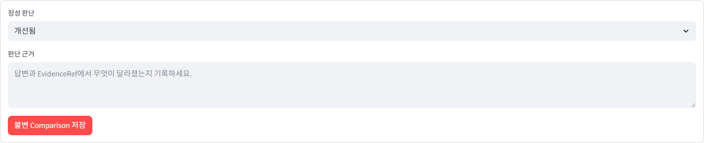

14. **Issue 종결 준비** — 허용된 종결 상태와 사유 입력 영역을 확인한다. 촬영 과정에서는 실제 원격 상태를 변경하지 않았다.

    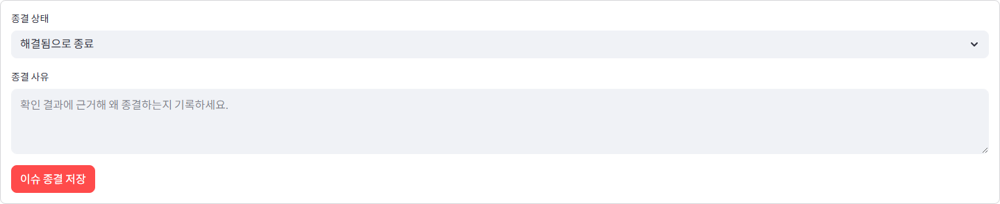

촬영 조건과 재생성 명령은 [Monitoring 스크린샷 안내](../images/monitoring/README.md)에 있다.

<!-- PAGE BREAK -->

# 주요 컴포넌트 생명주기

```text
Issue         OPEN → IN_PROGRESS → RESOLVED | NOT_ISSUE      (legacy CLOSED → 재분류)
Fixture       DRAFT → READY                                   (READY 이후 불변, 새 revision)
FixedSnapshot DRAFT → TEMP 검증 → READY                       availability: AVAILABLE | LOCAL_MISSING | CORRUPT | INCOMPATIBLE
Case          DRAFT → READY                                   (READY 시 case_contract_id 고정)
Release       (app version + Git commit) → REGISTERED
Run           QUEUED → RUNNING → SUCCEEDED | FAILED | CANCELLED | INTERRUPTED   (+ VALID | INVALID)
Comparison    → IMPROVED | NOT_IMPROVED | REGRESSED | INCONCLUSIVE              (불변, supersede로 갱신)
```

<!-- PAGE BREAK -->

# 1. 권위와 적용 범위

## 1.1 현재 동작을 판단하는 우선순위

| 우선순위 | 기준 |
| --- | --- |
| 1 | 현재 코드·migration·테스트 (실제 실행 계약) |
| 2 | 이 운영 가이드 (운영 절차의 canonical 설명) |
| 3 | Monitoring·Architecture 문서 (화면 진단·구조 상세) |
| 4 | 미래 release 설계 (목표일 뿐 현재 동작 아님) |
| 5 | historical plans·deliverables (의사결정 이력) |

이 문서의 “구현됨”은 **2026년 9월 12일 로컬 코드·테스트 확인**을 뜻한다. hosted Supabase 적용이나 실제 운영 데이터 호환까지 확인했다는 뜻은 아니다.

## 1.2 다루는 것과 다루지 않는 것

**다루는 것:** 신고·안전한 원격 payload, durable outbox와 Supabase ingest, 운영자 이슈 분류와 감사, 재현 자산(Fixture·Snapshot·Lineage·Case) 계약, 릴리스 격리 실행과 Baseline/Candidate 비교, 원격 control projection과 drift 차단, 장애 복구와 검증.

**완료를 주장하지 않는 것:** 자동 원인 분석·수정·PR·배포, 임계값 기반 자동 판정·종결, canary·qualification·PromotionRecord·installer·자동 rollback, hosted 배포 사실, node 단위 graph 회귀 비교, 사용자 알림 루프.

<!-- PAGE BREAK -->

# 2. 전체 흐름

도식에서 `[강제]`는 코드·DB 거부 조건, `[권장]`은 운영자가 지켜야 하지만 Issue API가 선행 조건으로 검사하지 않는 단계다.

```text
Chat 신고
  └─ [강제] 동의 + redaction preview + durable outbox enqueue
       └─ [강제] Supabase ingest 검증·멱등 저장
            └─ Issue OPEN + CREATED event
                 └─ 신고 선택 → [강제] 원문 자동 조회(RAW_VIEWED audit) → [권장] IN_PROGRESS
                      └─ [강제] Fixture / FixedSnapshot / Case READY
                           └─ [강제] Baseline Run → [권장] 재현 확인 → [강제] Candidate Run
                                └─ [강제] 같은 Case의 VALID Run만 Comparison → [권장] RESOLVED | NOT_ISSUE
```

한 문제를 처리하는 가장 중요한 identity는 `case_contract_id`다. Fixture·Snapshot·고정 시각·evaluator·Lineage 증명이 이 값에 묶이며, 공식 Comparison은 양쪽 Run이 같은 `case_contract_id`일 때만 가능하다.

운영 화면은 세 작업 공간으로 나뉜다: **작업함**(무엇이 신고됐고 어떤 상태인가), **테스트 케이스 설정**(어떤 질문·자료로 재현하는가), **개선 확인**(Baseline과 Candidate를 나란히 실행·비교하고 개선 여부를 판단·종결한다). 내부 ID·hash는 운영자가 입력하지 않고 시스템이 계산한다.

<!-- PAGE BREAK -->

# 3. 저장과 권위의 분리

| 정보 | 권위 위치 |
| --- | --- |
| 신고 원문 | Supabase `private.issue_reports` |
| Issue 상태·감사 이력 | Supabase Issue·event (단일 기준) |
| 전송 대기 payload | 로컬 outbox (terminal 후 삭제, 임시) |
| Fixture·Case·Release·Run·Comparison 본문 | 로컬 `MONITORING_ARTIFACT_ROOT` registry·artifact |
| FixedSnapshot bytes | 로컬 managed artifact root |
| control projection | Supabase control record·event (ID·digest·가용성의 제한 감사) |
| 신고 원문 cache·reproduction seed | 현재 session memory (로그아웃 시 제거) |
| Chat 답변·graph snapshot | 로컬 conversation store message metadata |

Issue 상태 변경은 Supabase API만 호출한다. 로컬 registry의 Issue row는 재현 자산을 묶는 anchor일 뿐 production lifecycle의 두 번째 권위가 아니다.

원격 projection은 로컬 내용의 백업이 아니라, 로컬 identity와 불변 기록이 예상 순서로 존재하는지를 확인하는 감사 경계다. Fixture·Case 본문, 답변·EvidenceRef, runtime profile, 로컬 경로, Snapshot 내부 catalog, Comparison의 반복 Run 목록, Chat GraphManifest·NodeRun은 원격에 보내지 않는다.

<!-- PAGE BREAK -->

# 4. 신고와 안전한 수집

사용자는 Chat `신고`에서 문제 응답 또는 화면·시스템 문제를 고르고 분류(답변 품질·검색 정확도·오답·속도·버그·기타)와 선택적 설명을 남긴다. 원격 전송 동의는 모두 기본 해제이며 `추가 설명`, `선택한 질문과 응답`, `선택한 응답까지의 질문과 검색 상태`를 따로 선택한다. 마지막 항목은 최대 8개 turn의 user 질문·route·filter·문서 범위만 보내고 과거 assistant 답변 본문은 포함하지 않는다. 선택한 응답 본문은 `선택한 질문과 응답`에 별도로 동의한 경우에만 제한된 길이로 포함한다.

제출 전에 credential·개인정보·로컬 절대경로를 가리고 실제 전송 형태의 redaction preview를 보여준 뒤, outbox에 durable enqueue가 성공해야만 `신고가 접수되었습니다.`를 표시한다. HTTP 전송·재시도는 background worker가 처리하며, 원격 기능이 꺼지면 로컬 파일로 우회하지 않고 제출을 비활성화한다.

**outbox·ingest 계약 요약**

| 항목 | 계약 |
| --- | --- |
| 단일 event / outbox 전체 | 128 KiB / 50 MiB 또는 1,000건 |
| 재시도 / lease / 만료 | 최대 3회 / 60초 / 7일 |
| terminal 처리 | 성공·영구 거절·재시도 소진·만료 시 row·payload 삭제 |
| ingest 검증 | publishable key, body size, 지원 contract(v2·v3)의 exact schema, timestamp, 동의 일치, 민감정보 잔존, quota, `event_id` 멱등성 |

<!-- PAGE BREAK -->

# 5. Issue 생명주기

| 상태 | 화면 표현 | 의미 |
| --- | --- | --- |
| `OPEN` | 미확인 | 확인 전 또는 재열림 |
| `IN_PROGRESS` | 조치 중 | 조사·재현·개선 진행 |
| `RESOLVED` | 해결됨 | 해결로 분류한 terminal |
| `NOT_ISSUE` | 이슈 아님 | 의도된 동작·오해·중복 등 |
| `CLOSED` | 종료(미분류) | legacy terminal 값, 재분류 가능 |

허용 전이: `OPEN → IN_PROGRESS|RESOLVED|NOT_ISSUE`, `IN_PROGRESS → OPEN|RESOLVED|NOT_ISSUE`, `RESOLVED → OPEN|NOT_ISSUE`, `NOT_ISSUE → OPEN|RESOLVED`, `CLOSED → OPEN|RESOLVED|NOT_ISSUE`(legacy). 신규 전환은 `CLOSED`를 만들지 않는다.

모든 전이는 1~2,000자 사유와 `expected_record_revision`을 요구한다. 서버는 compare-and-swap로 갱신하고 append-only event를 남기며 stale revision은 conflict를 반환한다.

신고 원문은 선택 즉시 자동 조회되고 최초 1회 `RAW_VIEWED` audit을 남긴다(같은 session은 cache). 원문이 만료로 없으면 `raw_unavailable`로 표시하고 요약만으로 사실을 추정하지 않는다.

종결에서 **서버 강제**는 사유·CAS·허용 전이·활성 admin이며, **권장 운영 순서**는 `IN_PROGRESS → 재현 → Baseline/Candidate → Comparison → RESOLVED`다. 현재 `RESOLVED`에 성공 Comparison이 필수 gate가 아니라는 점은 유의한다. 실행 비교가 불필요한 경우(중복·오해·의도된 동작)는 `NOT_ISSUE`로 단축한다.

<!-- PAGE BREAK -->

# 6. 재현 자산

| 자산 | 역할 | 상태·불변조건 |
| --- | --- | --- |
| Fixture | “무엇을 실행하고 어떻게 확인할지” | `DRAFT → READY`, READY 후 불변·새 revision |
| FixedSnapshot | self-contained Native V2 자료 묶음(catalog+FAISS) | TEMP 검증 후 `READY`만 등록, 실행 시 자기 bytes만 사용 |
| ReconstructionLineage | 신고 당시 source ↔ 현재 Snapshot 대응 증명 | `EXACT`·`PARTIAL`·`SUBSTITUTE_INCLUDED`, 예외는 사유 필수 |
| ReproductionCase | 재현 계약 묶음 | `DRAFT → READY`, READY 시 `case_contract_id` 고정 |
| Release | 실행 가능한 등록 bundle | identity = app version + full Git commit, `REGISTERED` |

Fixture typed check allowlist: `ANSWER_CONTAINS`, `ANSWER_NOT_CONTAINS`, `EVIDENCE_CONTAINS`, `CITATION_PRESENT`, `ROUTE_EQUALS`, `MANUAL`. Case는 READY Fixture·가용 Snapshot·비어 있지 않은 evaluator·확인된 Lineage가 있어야 READY가 된다.

FixedSnapshot의 `AVAILABLE / LOCAL_MISSING / CORRUPT / INCOMPATIBLE`은 저장 lifecycle을 되돌리는 상태가 아니라 현재 bytes에서 계산한 availability다. Git Release `LOCAL_MISSING` cache는 등록 commit에서 자동 재생성하고, FixedSnapshot은 새 revision과 Case로 이어간다.

<!-- PAGE BREAK -->

# 7. 실행과 비교

등록된 Release는 임시 workspace로 복사되고 하나의 FixedSnapshot만 실행 layout으로 준비된다. runner는 import path를 격리하지만 현재 interpreter·site-packages를 쓰므로 dependency 전체가 hermetic하지는 않다. credential은 실행 시 전달하고 artifact에 보존하지 않는다. Baseline은 신고된 release를 써야 하며, Candidate에서는 신고 release를 제외한다.

```text
Run: QUEUED → RUNNING → SUCCEEDED | FAILED | CANCELLED | INTERRUPTED
```

Run의 Issue·Case·Release·side·runtime profile은 queue 뒤 불변이다. terminal 전이는 result artifact를 create-only로 만든 뒤 registry에 연결하고, 로컬 terminal record를 불변 저장한 뒤 원격 projection을 best-effort 동기화한다(`QUEUED`·`RUNNING` projection 실패는 실행 중단, terminal 실패는 경고만). terminal Run은 덮어쓰지 않는다.

성공 Run은 raw answer, bounded EvidenceRef, route summary, typed check 결과, 실제 runtime profile, latency, evidence qualifier를 요구한다. queue에 고정한 profile과 실제 profile이 다르면 `INVALID`, 공식 비교에는 `SUCCEEDED + VALID` Run만 쓴다.

**Comparison verdict**

| verdict | 의미 |
| --- | --- |
| `IMPROVED` | 의미 있게 개선됨 |
| `NOT_IMPROVED` | 변경했으나 미해결 |
| `REGRESSED` | 후보가 악화됨 |
| `INCONCLUSIVE` | 자료·반복·수동 판단 필요 |

Comparison은 같은 Issue·`case_contract_id`의 Baseline·Candidate를 각각 하나 이상 요구하고, note·actor가 필요하며 생성 후 불변이다. 재판단은 `supersedes_comparison_id`로 이어가는 새 record다. 자동 typed check는 좁은 조건만 평가하고 `MANUAL`은 `passed=null`·`manual_review_required=true`로 남는다. 자동 check 통과는 품질 자동 승인도 종결 명령도 아니다. 고정 횟수·절대 점수·자동 통과 임계값은 없다.

<!-- PAGE BREAK -->

# 8. 운영자 실행 절차

**진입·인증:** production 설정(deployment flag, 같은 Supabase project의 URL·publishable key·operator URL, 설정에서 해석되는 artifact root) 확인 → 활성 `private.monitoring_admins` 로그인 → access token은 session memory만, refresh token·비밀번호 미저장. 초기 admin은 배포 담당자가 migration 후 한 번 등록한다.

```sql
insert into private.monitoring_admins (user_id) values ('<auth.users.id>');
```

**작업함:** Issue 선택 → 동의 원문 확인 → 조사 시작 시 사유와 `IN_PROGRESS` → 원문 없으면 `raw_unavailable`(요약을 사실로 승격하지 말 것). 최근 200건이 count 기준이다.

**테스트 케이스 설정:** 원문에서 reproduction seed → 기대 동작·check 검토 → Fixture READY → 관찰 UID·filter 제안 확인 → 최종 문서 범위 확정 → FixedSnapshot 생성·Lineage 예외 확인 → Case READY로 `case_contract_id` 확정. `FixedSnapshot READY 생성` 전 add/remove는 session 선택일 뿐 영속 자산이 아니다.

**개선 확인:** 화면이 항상 Baseline·Candidate 2열로 열린다. 각 열의 실행 버튼으로 Baseline(신고 release)과 Candidate(후보 release)를 실행하고, 검사·답변·EvidenceRef로 재현 판단 → 미재현이면 질문·범위·Lineage·검사부터 재검토 → 필요만큼 반복. 미완료 `QUEUED/RUNNING`이 있으면 새 Run 금지, 다른 process가 없을 때만 `INTERRUPTED + INVALID`로 봉인.

**비교·종결(개선 확인 탭에서 이어서):** 같은 Case의 `SUCCEEDED + VALID` 선택 → 답변·근거·check·latency·profile·qualifier 비교 → verdict·note 저장 → 그 아래 이슈 종결(`해결됨`/`이슈 아님` + 사유)로 바로 이어지며, `IMPROVED`면 projection 재확인 → 사유와 `RESOLVED`(또는 `NOT_ISSUE`). `RESOLVED`에 Comparison이 hard gate가 아니라는 현재 제한은 11장 참고.

<!-- PAGE BREAK -->

# 9. 원격 projection과 차단

control projection은 로컬 자산 전체를 복제하지 않고, 어떤 identity·lifecycle로 판단했는지 감사하게 한다(record kind: Fixture·Case·FixedSnapshot·Release·Run·Comparison). 상태 변화는 revision CAS를 쓰고, 불변 record의 digest가 다르면 `immutable_conflict`로 차단한다. 동기화는 `Fixture → FixedSnapshot → Case → Release → Run → Comparison` 순서를 보존한다.

다음이면 작업을 막는다: 예상치 못한 원격 identity, digest 불일치, revision conflict, 로컬 Issue 없이 남은 원격 record, Snapshot·Release availability 불신, 미완료 Run. projection은 backup이 아니므로 로컬 registry가 사라지면 metadata로 재구성하지 않고 exact artifact 복원을 요구한다.

<!-- PAGE BREAK -->

# 10. Chat 진단과 공식 Run 증거의 차이

| 구분 | 목적 | 보존하는 핵심 증거 |
| --- | --- | --- |
| 개별 Chat Monitoring | 신고 원인 이해·reproduction seed 준비 | `graph_manifest`, `node_runs`, turn 지표·검색 근거 |
| 공식 Baseline/Candidate Run | 같은 Case에서 릴리스 결과 검증·비교 | 답변, EvidenceRef, route summary, typed check, runtime profile, latency |

공식 Run에는 `graph_manifest`·`node_runs`가 없으므로 Chat의 node 시간·topology를 회귀 결과로 해석하지 않는다.

<!-- PAGE BREAK -->

# 11. 장애 복구와 알려진 제한

| 증상 | 처리 |
| --- | --- |
| `method_not_allowed` | migration 순서 적용 후 `issue-report-operator` 재배포, action POST 확인 |
| `unauthorized`·session 만료 | 비밀번호 미저장, 재로그인 |
| `forbidden` | admin UUID·active 상태 확인 |
| `revision_conflict` | 최신 상태 재조회 후 재시도 |
| `raw_unavailable` | 요약만으로 Fixture 확정 금지, 근거 부족 명시 |
| control drift | 새 Run·전환 중단, exact artifact·projection 대조 |
| Snapshot·Release missing/corrupt/incompatible | 새 revision·새 Case로 이어가거나 등록 commit에서 재생성, 덮어쓰기 금지 |
| 미완료 Run | 다른 process 없음 확인 후 `INTERRUPTED + INVALID` 봉인 |
| runner 실패·timeout | 원인 수정 후 새 Run, terminal record 불변 |
| artifact digest mismatch | 결과 미사용, 새 Run |

`method_not_allowed`는 method를 GET으로 바꾸는 문제가 아니며 lifecycle API는 `/issues/{id}/start|resolve|dismiss|reopen`에 POST를 쓴다.

## 11.1 FixedSnapshot 검색 표시 해석

`report_type=industry` filter가 있으면 industry 문서가 자동 제안된다. 직접 검색의 `추가할 수 있는 문서`는 이미 현재 Snapshot 범위에 들어간 UID를 제외한 건수이므로 0건이 전체 catalog 0건이라는 뜻은 아니다. 증권사 선택지는 문서 유형과 독립적으로 전체 활성 문서에서 만들기 때문에 조합에 따라 결과가 없을 수 있다. 먼저 `현재 Snapshot 범위`를 확인하고, 필요하면 증권사를 `전체`로 되돌린 뒤 READY 등록 전에 최종 범위를 검토한다.

## 11.2 알려진 계약 간격

- Comparison 없이도 `RESOLVED`가 가능하다.
- manual check 결과는 별도 record가 아니라 Comparison note·verdict에 남는다.
- 공식 Run에는 node-level graph trace가 없다.
- 관찰 UID 하나가 active publication에서 사라지면 자동 proposal 전체가 실패할 수 있다.
- terminal Issue 전환의 projection gate는 UI/service 선행 검사일 뿐 서버 transaction과 원자적이지 않다.
- Release runner는 interpreter·site-packages까지 고정하지 않는다.
- hosted Supabase 적용은 로컬 테스트만으로 증명할 수 없다.

<!-- PAGE BREAK -->

# 12. 구현 경계와 후속 범위

**현재 구현됨:** Chat 신고(동의·preview·outbox), 원격 접수(멱등 저장·OPEN Issue), 운영자 인증, Issue 4상태 분류·append-only event, 재현 자산(versioned Fixture·Snapshot·Lineage·Case), 릴리스 격리 실행, 반복 Run·같은 Case 비교·superseding history, metadata-only control projection, Chat 응답별 graph manifest 렌더링.

**아직 없음:** 자동 원인 분석·수정·PR·merge, 자동 품질 gate, release promotion(qualification·PromotionRecord·canary·installer), 배포 후 자동 rollback, versioned evaluation suite·CI gate, official Run 간 node 회귀 비교, 사용자 후속 알림.

<!-- PAGE BREAK -->

# 13. 검증과 배포 판정

**로컬 검증:** 커밋 직전에 아래 핵심 회귀와 전체 suite를 돌린다.

```text
python -m pytest tests/monitoring_v8 tests/test_fixed_snapshot.py \
  tests/test_release_assets.py tests/test_reproduction_runner.py \
  tests/test_operator_monitoring_views.py tests/test_monitoring_admin_client.py \
  tests/test_supabase_monitoring_operator.py tests/e2e -q
python -m pytest -q
```

결과를 기록할 때는 실행 날짜·commit hash·pass/skip/fail 수를 함께 남긴다.

**hosted 배포 판정**은 로컬 테스트와 별개로: migration 순서 적용, `issue-report-ingest`·`issue-report-operator` 현행 배포, 초기 admin 등록, 비관리자 403·원문 열람 audit, lifecycle POST 정상, projection drift 차단, Snapshot·Release·Run restore smoke 확인이 필요하다.

<!-- PAGE BREAK -->

# 14. 구현 근거와 변경 정책

## 14.1 주요 구현 파일

| 책임 | 파일 |
| --- | --- |
| Chat 신고·동의 UI | `apps/gui/chat_views.py` |
| remote payload·outbox | `src/core/issue_report_outbox.py` |
| operator API client | `src/core/monitoring_admin_client.py` |
| production operator UI | `apps/gui/operator_monitoring_views.py` |
| 로컬 registry·불변 계약 | `src/core/operator_monitoring.py` |
| 원격/로컬 orchestration | `src/core/operator_monitoring_service.py` |
| self-contained Snapshot | `src/core/fixed_snapshot.py` |
| runnable Release | `src/core/release_assets.py` |
| 격리 runner | `apps/cli/reproduction_runner.py` |
| Chat graph snapshot | `src/core/graph_observability.py`, `apps/gui/chat_jobs.py` |
| Supabase lifecycle | `supabase/functions/issue-report-operator/`, `supabase/migrations/20260830*.sql` |

## 14.2 관련 문서와 변경 정책

- `MONITORING.md`: 운영자 화면·개별 Chat 지표·trace 상세
- `../architecture/ARCHITECTURE.md`: 전체 데이터 흐름과 graph observability 구조

다음이 바뀌면 이 문서를 같은 변경에서 갱신한다: Issue 상태·허용 전이·종결 gate, consent·redaction·outbox 보존 계약, Fixture check allowlist·Case contract 구성, Snapshot manifest·reader contract·Lineage qualifier, Release·Run schema·Comparison verdict, Supabase control projection field·권위 경계, official Run과 Chat evidence의 연결 여부, Monitoring 작업 공간·navigation.
